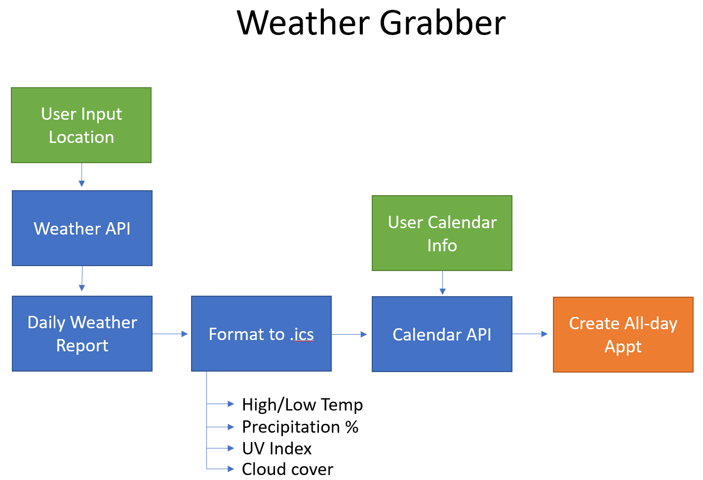

# Weather Grabber 
Application takes input from a weather API and formats the daily weather report into a .ics format. This application then creates an event on Google Calendar with the daily weather summary.

