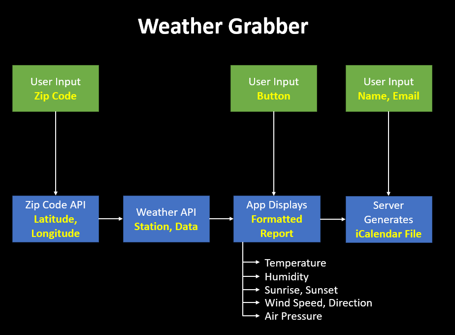

# Weather Grabber

#### Application takes input from a weather API and formats the daily weather report into a .ics format. This application then creates an event on Google Calendar with the daily weather summary.

#### APIs used for this application:
- : for transforming user input zip code into latitude and longitude for MetaWeather querying
- : for getting weather data based on the latitude and longitude of the user
---
