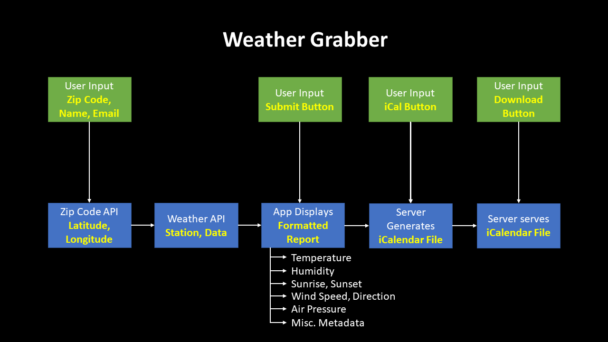

# Weather Grabber

#### The Weather Grabber is a simple web-application that takes user input and provides a daily weather forcast to the user. This application sends data through a location and weather API, and then formats the data into a daily weather report in .ics format. This application then creates a ready-to-send email with the daily weather summary.

## Instructions

#### This application relies on a proxy-server for requests to APIs with strict access control policies. To start both the proxy server on localhost://8080 and the application concurrently simply do the following:
1. Fork and clone/pull down the entire repository
2. While at the root of the repository, in your command line, execute ```npm install``
3. While at the root of the repository, in your command line, execute ```npm start```
    - This will execute ```node server.js``` and ```react-scripts start``` at the same time
    - The proxy-server (server.js) will run in the background on localhost://8080
    - The Weather Grabber application will pop-up in-browser on localhost://(port, e.g. 3000)

#### APIs used for this application:
- [ZipCodeAPI](https://www.zipcodeapi.com/): for transforming user input zip code into latitude and longitude for MetaWeather querying
- [MetaWeather](https://www.metaweather.com/): for getting weather data based on the latitude and longitude of the user

#### Notable modules used for this application:
- [cors-anywhere](https://github.com/Rob--W/cors-anywhere): proxy-server which adds CORS headers to the proxied request
- [ics](https://github.com/adamgibbons/ics): formats inputs into iCalendar (ics)-compliant data
- [create-react-app](https://github.com/facebook/create-react-app): sets-up a react app in one command

## Concept of Operations

